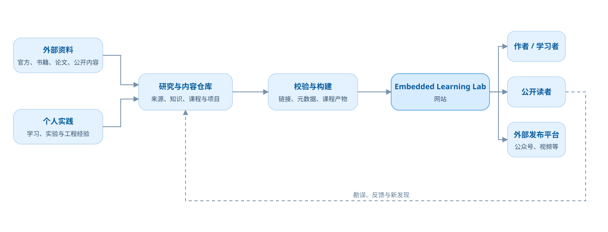
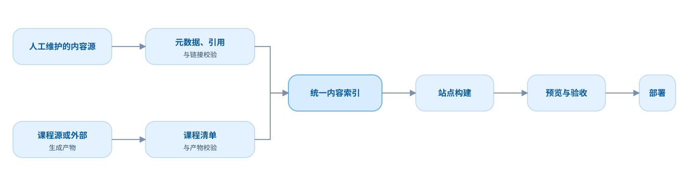

# 第一版技术架构

本文件记录第一版已经确认并开始落地的技术边界。基础站点已经初始化，后续实现仍须保持在这些边界内。

## 系统上下文

主链路保持单向：资料与实践进入内容仓库，经校验构建为网站，再服务作者、读者和外部发布平台。反馈使用单独的虚线回路，避免与主流程混在一起。

## 候选内容构建流水线

图中描述已经确认的职责边界。

## 已选技术

- Astro 静态输出；
- Astro Content Collections 与 Zod 内容校验；
- Markdown + YAML，少量 MDX；
- Pagefind 静态全文搜索；
- npm；
- 浏览器本地学习状态与 JSON 导入/导出；
- GitHub Actions 检查和构建；
- GitHub Pages 发布。

## 当前落地状态

- `apps/site/` 已建立 Astro 静态站点，使用 npm 锁定依赖；
- 根目录 `content/` 保持为不依赖 Web 框架的权威内容源，由站点 Content Collection 读取并校验；
- 已实现设计令牌、浅深主题、响应式主导航、首页、路线、Knowledge、搜索、关于与 404 页面；
- 已接入课程 Collection、课程审核入口和 UART v0.4.0 独立多页面课程包；课程包含课程首页、五篇课文、共享 CSS、原生 JavaScript 互动和入门速查；
- Pagefind 在生产构建后生成静态中文索引；
- `.github/workflows/deploy.yml` 负责检查、构建并发布 GitHub Pages；仓库 Pages 发布源已启用并通过首次完整部署验证；
- 当前已实现课程产物的静态复制和主站入口，尚未实现浏览器学习状态、受限制嵌入容器、互动实验和专项内容校验脚本。

## 内容层

采用：

- 普通内容使用 Markdown 与结构化 YAML；
- 互动内容按需使用 MDX；
- Content Collections/Zod 在构建期校验；
- 稳定业务 ID 不依赖路径或框架生成；
- 来源、关系和课程字段按产品 Schema 管理；
- 大型二进制资料不默认提交，必须单独决策。

## 课程层

采用：

- 课程 manifest、批准后的版本化 HTML 产物和校验值进入 Git；
- 独立课程包位于 `courses/<course-slug>/<version>/`，内部按需使用 `index.html`、`lessons/`、`reference/` 和 `assets/`；
- 独立 HTML 通过受限制的嵌入容器接入；
- 小型消息协议同步课程、章节、版本和进度；
- 主站统一入口和返回导航，课程内部允许专用教学布局；
- 课程更新依靠稳定课程与章节 ID 迁移学习状态。

## 应用层

采用：

- 静态站点；
- Astro 页面与布局；
- Pagefind 搜索；
- 简单互动优先原生 TypeScript；复杂互动出现后只选择一个客户端框架；
- 学习状态保存在浏览器并可导入导出；
- 内容全部公开，不实现私有内容模式。

## 工程层

采用：

- npm 与锁文件；
- Lint、格式化、类型检查和分层测试；
- 内容、链接、来源、状态、图源和课程产物检查；
- GitHub Actions 构建；
- GitHub Pages 部署；
- 依赖 GitHub 远端作为第一版仓库备份，不建设额外备份系统；
- 每个稳定工作单元及时提交并推送，保证 GitHub 备份前提成立。

## 非功能要求

第一版要求：

- WCAG 2.2 AA 目标；
- 移动端与桌面端响应式；
- Light / Dark；
- 普通知识页首屏压缩后 JavaScript 暂定不超过约 100 KB；
- 互动内容按需加载；
- 主流桌面和移动浏览器近两个稳定版本；
- MIT 代码许可与 CC BY-SA 4.0 内容许可。
