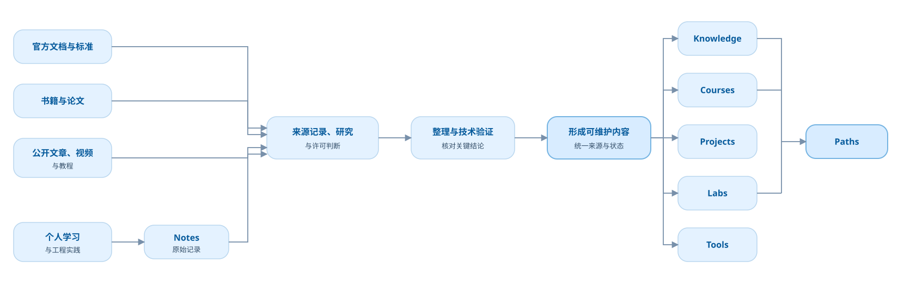
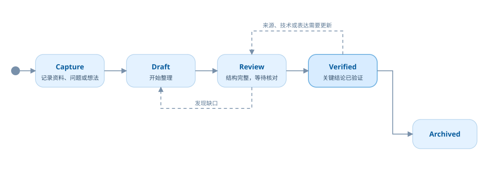

# 产品内容模型

本文件定义不同内容类型的长期职责，不代表第一版全部实现。第一版范围由 `first-release-scope.md` 约束。

## 总体原则

项目不生产外部技术事实。标准、官方手册、教材、论文、文章、视频和开源项目保持各自的作者、版本和权威边界；项目生产的是资料卡、关系、阅读定位、跨来源比较、学习顺序、独立解释和实验结果。

## Sources

资料库回答：

> 这份资料是谁维护的、哪一版可用、解决什么问题、应该读哪里、可以怎样引用或复用？

Sources 是其他内容类型的基础层。它保存来源身份、等级、版本、许可、访问方式、适用阶段、阅读定位、限制和关联内容，不保存未经授权的全文副本。详细规则见 [`source-library.md`](source-library.md)。

## Paths

学习路径回答：

> 为了达到一个目标，我应该按什么顺序学习？

路径组织资料、主题指南、课程、实验和项目，不复制正文。

## Knowledge

Knowledge 在产品界面中称为“主题指南”，回答：

> 为理解这个主题，应该看哪些来源；这些来源如何互补、冲突或落到实践？

主题指南不是标准或厂商手册的替代品。它可以提供必要的独立解释和跨来源对照，但每个关键结论必须回到资料卡、具体引用或项目实验。内部类型名暂时保留 `knowledge`，避免在资料库纵向切片验证前进行无价值的框架迁移。

## Courses

课程回答：

> 我怎样循序渐进地学会并练习它？

课程可以包含导读、章节、互动、练习、自测和进度。课程负责安排“先看什么、为什么看、怎样练、如何证明学会”，并把学习者带回资料、主题指南和实验。

课程不是外部资料的拼接或改写副本。它只在确有教学需要时补充解释，主要原创价值来自学习目标、顺序、比较、练习、反馈和验收证据。

## Labs

实验回答：

> 改变输入、参数或状态后，会发生什么？

实验用于解释时序、状态、信号、拓扑、内存和算法等难以仅靠文字理解的机制。

## Projects

项目回答：

> 如何把知识组织成一个真实、可验证的工程成果？

项目可以关联需求、设计、实现、测试、复盘和发布记录。

## Notes

笔记回答：

> 我遇到了什么、查到了什么、还需要验证什么？

笔记允许不完整，但必须标记状态，不能自动获得公开知识的可信度。

## Tools

工具回答：

> 如何更快、更可靠地完成一个具体工程任务？

工具必须解决真实任务，并关联其依据的资料、主题指南或实验。

## 来源与内容关系

这张图描述旧版实现已经具备的来源输入和内容形成过程；新的约束是“来源记录”升级为一等 Sources，而 Knowledge 只承担主题指南。课程研究中发现的新资料先进入 Sources，可靠解释再进入主题指南。Projects、Labs 和 Tools 的关系由元数据和详情页呈现，不在图中绘制密集交叉线。

## 内容成熟生命周期

发布不属于成熟度。正式状态以 `content-schema.md` 为准，网站可见性另行记录。

## 第一版取舍

- Sources 是技术事实和外部内容身份的首选入口；
- Knowledge 是跨来源主题指南，不再被描述为原始权威正文；
- Courses 是第一版主要学习入口，重点是顺序、练习和验证；
- Labs 首先作为课程或 Knowledge 内的互动，出现真实复用后再提升为独立内容；
- Notes、Projects 和 Tools 保留长期职责，第一版不建设独立网站入口；
- 面试题是策展视图，答案反向引用 Sources、主题指南和实验依据。
