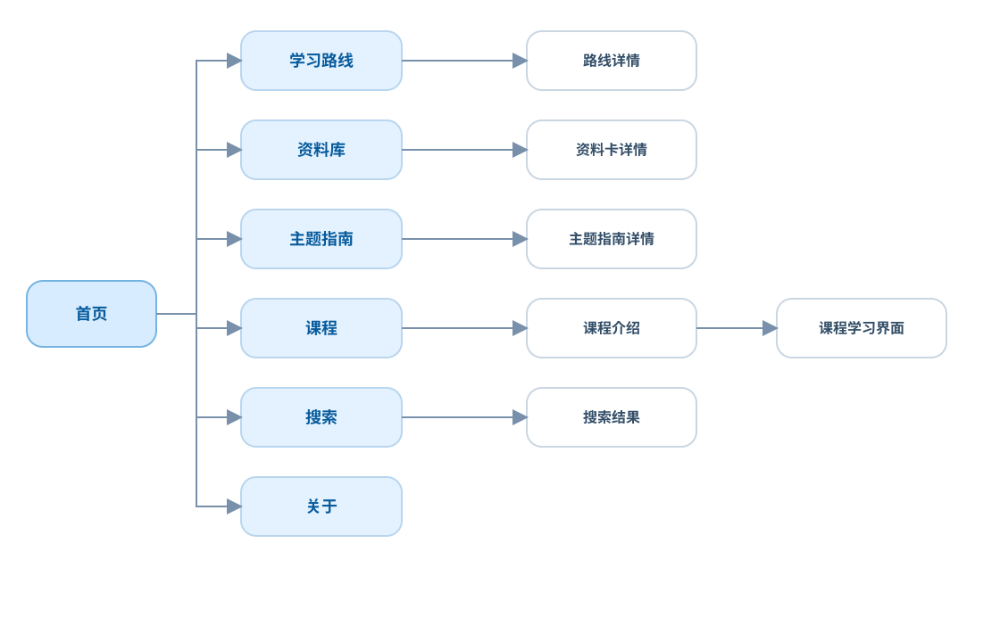

# 信息架构草案

## 首页职责

首页应帮助用户回答三个问题：

1. 这个项目是什么？
2. 我应该从哪里开始？
3. 当前有哪些真实可用的内容？

## 首页结构

```text
首页
├─ 项目定位
├─ 从这里开始 / Featured Paths
├─ 精选专题
├─ 交互课程
├─ 实验与项目
├─ 最近更新
└─ 关于项目
```

## 网站地图



主导航图只表达页面层级。知识专题、课程、实验和项目之间的交叉关系，应在详情页通过“相关内容”呈现，不把所有关联线塞进网站地图。

## 首页低保真草图

```text
┌────────────────────────────────────────────────────────┐
│ Embedded Learning Lab               搜索        关于   │
├────────────────────────────────────────────────────────┤
│ Read. Experiment. Build.                               │
│ 个人嵌入式学习与工程实验室                              │
│ [从这里开始]                                            │
├────────────────────────────────────────────────────────┤
│ 精选学习路径                                            │
│ ┌────────────┐ ┌────────────┐ ┌────────────┐            │
│ │ 路径 A     │ │ 路径 B     │ │ 路径 C     │            │
│ └────────────┘ └────────────┘ └────────────┘            │
├────────────────────────────────────────────────────────┤
│ 分类浏览                                                │
│ 编程｜电路｜MCU｜通信｜RTOS｜系统｜调试                 │
├────────────────────────────────────────────────────────┤
│ 精选专题             交互课程             实验与项目    │
├────────────────────────────────────────────────────────┤
│ 最近更新                                                │
└────────────────────────────────────────────────────────┘
```

## 知识领域

- 编程基础；
- 计算机与硬件基础；
- MCU 与裸机开发；
- 接口与通信；
- 实时系统；
- Embedded Linux；
- 网络与 IoT；
- 工程、测试与调试；
- 系统设计与可靠性。

分类用于内容发现，不代表必须按相同名称创建物理目录。

## 导航原则

- 导航只展示已有真实内容的入口；
- 长期架构不直接等于顶部导航；
- 用户可以按路径、主题、内容类型和关联关系发现内容；
- 不以发布时间倒序作为唯一浏览方式；
- 课程、知识、实验和项目应有清晰的视觉类型标识。

## 第一版顶部导航

```text
首页｜学习路线｜知识库｜课程｜面试题库｜关于
```

搜索是全站功能。没有真实内容的 Labs、Projects、Tools 等长期类型不建立空入口。

## 页面层级

```text
首页
├─ 学习路线总览
│  └─ 路线详情
├─ Knowledge 索引
│  └─ Knowledge 详情
├─ 课程索引
│  ├─ 课程介绍
│  └─ 课程学习界面
├─ 面试题库
│  └─ 题目详情
├─ 搜索结果
└─ 关于项目
```

## 永久 URL

```text
/paths/
/paths/<slug>/
/knowledge/
/knowledge/<slug>/
/courses/
/courses/<slug>/
/courses/<slug>/<lesson-slug>/
/interview/
/interview/<slug>/
/about/
/search/
```

分类和标签不进入 Knowledge 永久 URL，避免内容调整领域时破坏链接。

## 首页与视觉原则

- 第一版使用同一公开首页，不建设个人仪表盘；
- 借鉴 Chenxu Qiao 的轻量信息层级，以及嵌问的搜索、练习、成果与验收闭环；
- 不复制参考站的配色、卡片、图标、文案或素材；
- 采用克制的工程学习实验室风格，优先保证排版、技术图和互动可读；
- 移动端长课程使用章节抽屉或当前章节入口，不直接移除定位能力。
