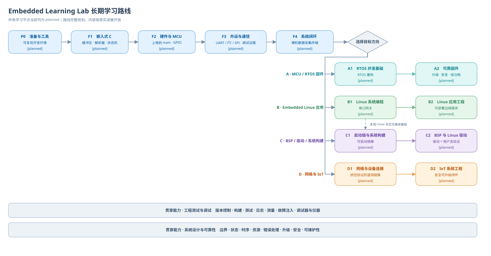

# 长期学习路线

本文定义 Embedded Learning Lab 的长期学习路线。路线用于回答“为了达到某个目标，应该按什么顺序学习”，不替代知识领域分类，也不复制课程或 Knowledge 正文。

## 路线与其他视图的边界

- **知识领域**负责稳定地组织概念，不表达唯一学习顺序；
- **学习路线**按目标组织 Knowledge、课程、实验、项目和工具；
- **面试题库**是策展视图，题目反向链接权威 Knowledge、课程和实验依据，不复制一套事实正文；
- 芯片、开发板、RTOS 和工具作为技术维度或标签，不成为顶层知识分类；
- 路线可以完整规划，但站点只为已有真实内容建立入口，不创建空栏目或占位内容。

## 节点状态

路线节点使用以下状态，状态描述的是内容可用程度，不是学习者个人进度：

| 状态 | 含义 |
| --- | --- |
| `available` | 已有满足发布要求的课程、Knowledge、实验或项目，可沿路线实际学习 |
| `in-progress` | 已进入制作或验证，但尚未满足完整验收条件 |
| `planned` | 目标、范围和依赖已定义，尚未实现 |
| `exploring` | 方向仍在研究，范围、平台或学习顺序可能变化 |

路线状态随真实内容更新。当前 F1、F2、F3 因 UART 纵向切片已有可学习 Knowledge 而处于 `in-progress`；课程、互动和实机实验尚未通过验收，因此还没有节点达到 `available`。

## 路线总览

共同主干先建立编程、硬件、外设、通信和工程闭环能力，再按目标进入四条分支。工程测试调试与系统设计可靠性贯穿所有阶段，不是最后才补的一门课。

## 共同主干

### P0 — 学习准备与工程环境

**状态：** `planned`

**目标：** 建立可复现的学习与实验环境，理解源码成为可运行程序的最小流程。

**核心主题：**

- 终端、路径、二进制与十六进制；
- Git 的提交、差异、历史和回退；
- 编译、链接和基础调试；
- 实验记录与可复现说明。

**建议产出：** 一个可复现的练习仓库、若干可编译小程序和环境说明。

**验收：** 能独立编译运行、定位常见编译错误、比较和回退版本，并解释源码、目标文件与可执行文件的区别。

**前置：** 无。

### F1 — 嵌入式 C 与程序模型

**状态：** `in-progress`

**目标：** 掌握嵌入式开发真正依赖的 C 语言、内存和模块边界，而不是只记忆语法。

**核心主题：**

- 数组、指针、字符串、结构体、枚举和函数指针；
- 位运算、字节序、对齐和二进制数据表示；
- `const`、`volatile`、`static` 与生命周期；
- 栈、堆、静态存储区、边界和错误处理；
- 头文件、模块化和可测试接口。

**建议产出：** 环形缓冲区、二进制帧解析器和带测试的状态机。

**验收：** 能解释并复现越界、悬空指针、结构体填充、大小端和 `volatile` 的适用边界，并能借助调试器证明判断。

**前置：** P0。

### F2 — 计算机、数字硬件与 MCU 基础

**状态：** `in-progress`

**目标：** 理解程序如何在真实硬件上启动、访问内存并响应事件。

**核心主题：**

- CPU、总线、存储层次和内存映射 I/O；
- 电压、电流、数字电平、上拉下拉、时钟与复位；
- Cortex-M 处理器、异常和 NVIC 基础；
- 启动文件、链接脚本、内存布局和中断栈；
- GPIO 与基础输入输出实验。

**建议产出：** 上电到 `main` 的路径图、内存布局图和 GPIO 按键与 LED 实验。

**验收：** 能借助手册定位寄存器，说明复位、启动、中断入口和返回过程，并测量和解释输入电平。

**前置：** F1。

### F3 — 裸机外设、接口通信与证据化调试

**状态：** `in-progress`

**目标：** 建立“协议语义—控制器—引脚—波形—软件缓冲”的完整心智模型。

**核心主题：**

- GPIO、中断、定时器、PWM 与 ADC；
- UART、I²C 和 SPI 的帧、时序、电气边界与选型；
- 轮询、中断和 DMA 的成本与边界；
- GDB、JTAG/SWD、串口日志、万用表和逻辑分析仪；
- 超时、断线、缓冲区溢出和故障注入。

**建议产出：** UART CLI 或回环、定时采样、一个 I²C 或 SPI 传感器链路，以及成功和失败波形与排错记录。

**验收：** 能主动制造并定位 NACK、超时、断线、波特率不匹配或缓冲区溢出，结论具备日志、寄存器或波形证据。

**前置：** F2。

### F4 — 小型系统工程闭环

**状态：** `planned`

**目标：** 把孤立外设实验组织成可维护、可测试和可复盘的小型系统。

**核心主题：**

- 模块边界、状态机、事件循环和资源所有权；
- 超时、重试、错误码和故障恢复；
- 配置持久化、看门狗和基本资源预算；
- 构建配置、测试清单、文档与复盘。

**建议产出：** 一个包含传感器、UART CLI、配置和故障记录的裸机数据采集终端。

**验收：** 具备架构图、接口说明、可复现构建、测试清单、性能或资源数据及故障复盘，而不只是“能够运行”。

**前置：** F3。

## 分支 A — MCU / RTOS 固件

### A1 — RTOS 并发基础

**状态：** `planned`

**目标：** 先理解并发问题，再正确使用 RTOS 组织固件。

**核心主题：** 任务状态、优先级、调度、tick、上下文切换、队列、任务通知、信号量、互斥量、ISR API、优先级反转、死锁、栈水位和实时性。

**建议产出：** 将 F4 裸机项目重构为 RTOS 版本，并说明任务职责、通信、超时和资源所有权。

**验收：** 能解释任务拆分理由，测量栈与时延，并定位一次人为构造的竞争、死锁或优先级问题。

**前置：** F4。F3 后可以体验 RTOS，但正式进入 A1 前应先完成工程闭环。

### A2 — 可靠固件与升级

**状态：** `planned`

**目标：** 让设备在资源受限、异常和升级场景下保持可预测行为。

**核心主题：** 低功耗、DMA 与缓存边界、持久化、Bootloader、升级与回滚、看门狗、故障恢复、实时测量和设备安全基础。

**建议产出：** 一套可升级、可恢复并具备资源与时序预算的设备固件。

**验收：** 断电、通信失败或任务异常后的行为可预测，升级可验证并能安全恢复。

**前置：** A1。

## 分支 B — Embedded Linux 应用

### B1 — Linux 使用与系统编程

**状态：** `planned`

**目标：** 在 Linux 用户态构建能够访问设备、通信和诊断的可靠应用。

**核心主题：** Shell、权限、进程、文件 I/O、线程与 IPC、socket、GDB、Make/CMake、交叉编译、服务与日志。

**建议产出：** Linux 串口采集转发程序或网关服务。

**验收：** 能交叉编译和部署，分析进程、文件描述符、线程同步与网络故障，并以服务方式稳定运行。

**前置：** 最低为 F1；为了保持嵌入式上下文，推荐完成 F3 或 F4 后进入。

### B2 — Linux 应用工程

**状态：** `planned`

**目标：** 将用户态程序提升为可部署、可监控和可恢复的边缘应用。

**核心主题：** 事件驱动 I/O、配置与存储、守护进程、资源监控、部署升级、应用安全与测试。

**建议产出：** 可部署和监控的边缘服务。

**验收：** 在重启、网络中断和设备断连后能够按设计恢复，构建与发布可以复现。

**前置：** B1。

## 分支 C — BSP、Linux 驱动与系统构建

### C1 — 启动链与系统构建

**状态：** `planned`

**目标：** 理解从上电到用户空间的完整启动链和各组件边界。

**核心主题：** Boot ROM、Bootloader、Kernel、Device Tree、RootFS、交叉工具链、Buildroot 或同类系统构建工具、镜像、分区和启动日志。

**建议产出：** 一套可启动系统镜像和一张经过验证的启动链图。

**验收：** 能从日志定位启动失败阶段，修改配置、重新构建并解释各产物的职责。

**前置：** F4，以及 B1 中的 Linux 使用、系统编程和交叉编译基础。

### C2 — BSP 与 Linux 驱动

**状态：** `planned`

**目标：** 能够在 Linux 设备模型下安全地描述硬件、实现驱动并完成用户态验证。

**核心主题：** 设备模型、platform driver、字符设备、设备树匹配、中断、DMA、并发、生命周期、sysfs/debugfs 与驱动调试。

**建议产出：** 一个传感器或虚拟设备驱动及配套用户态验证程序。

**验收：** 完成探测、读写、异常清理、并发与生命周期分析，并具备错误注入和回归测试。

**前置：** C1，并复用 F2、F3 中的硬件、中断和总线知识。

## 分支 D — 网络与 IoT

### D1 — 网络基础与设备连接

**状态：** `planned`

**目标：** 理解从字节流到应用协议的边界与失效模式。

**核心主题：** TCP/IP 分层、IP、TCP、UDP、DNS、HTTP、TLS 基础、socket、序列化、协议设计、超时、重连与幂等。

**建议产出：** 设备遥测客户端和可观察的测试服务端。

**验收：** 能用抓包解释完整交互，并正确处理丢包、断网、重连和重复消息。

**前置：** F1；设备侧项目需要 F3 或 A1，Linux 网关侧项目需要 B1。

### D2 — IoT 系统工程

**状态：** `planned`

**目标：** 建立安全、可升级、可诊断的端到端设备连接闭环。

**核心主题：** MQTT 或 CoAP、设备身份、凭证、OTA、云边界、数据模型、离线缓存、安全与运维。

**建议产出：** 端到网关或云的遥测与控制闭环。

**验收：** 凭证不硬编码，异常网络下的数据一致性策略明确，升级可回滚，端到端故障可定位。

**前置：** D1，并至少具备 A1 或 B2 之一对应的设备侧或网关侧工程能力。

## 贯穿能力

### 工程测试与调试

该能力贯穿 P0 到所有分支，并随项目复杂度逐步加深：版本控制、构建、测试、静态分析、日志、测量、故障注入、调试器和硬件仪器。

### 系统设计与可靠性

该能力贯穿 P0 到所有分支：边界、状态、时序、资源、错误处理、看门狗、升级、安全和可维护性。

每个阶段的成果都应附带“证据包”：设计说明、可复现步骤、测试或测量结果、已知限制和复盘。

## 分支前置关系

| 目标分支 | 必要前置 | 推荐补充 | 说明 |
| --- | --- | --- | --- |
| A：MCU / RTOS | F4 | 无 | F3 后可体验，完成 F4 后再正式重构并发系统 |
| B：Embedded Linux 应用 | F1 | F3 或 F4 | 最低可从编程基础进入，但完成硬件主干更符合嵌入式目标 |
| C：BSP / 驱动与系统构建 | F4、B1 核心 | F2、F3 深入复习 | 先理解 Linux 用户态和交叉编译，再进入启动链与内核边界 |
| D：网络与 IoT | F1、D1 | 设备侧完成 A1；网关侧完成 B2 | D2 至少选择设备侧或网关侧的一套工程基础 |

各分支不是必须全部修完的课程套餐。综合项目可以按实际目标组合 A、B、C、D 中的部分能力。

## 第一版 UART 纵向切片

第一版只落地能够验证完整内容闭环的 UART 切片，不填满整条长期路线。

### 当前落地状态

- F1 已落地字节流和 C 缓冲区 Knowledge；`volatile`、环形缓冲区、二进制帧和状态机仍待实现；
- F2/F3 已落地 UART 通用模型和 STM32F103 USART Knowledge；时钟计算、中断、DMA 和证据化排错仍待实现；
- F4 的超时、缓冲区溢出、错误恢复和串口组件边界仍待实现；
- 已建立一门 6 单元 UART 课程骨架，处于 `review / unlisted`；
- 已发布 4 篇可独立查询的 Knowledge，并建立先修与继续学习关系；
- 至少一个关于帧、采样或波特率误差的互动；
- 一组练习或自测、一个实机回环或逻辑分析仪实验；
- 少量 UART、C 与中断面试题，答案链接到权威内容。

未完成项目继续保持 `planned` 或 `in-progress`；只有课程、练习、互动和实验达到验收条件后，路线节点才显示为 `available`。

### 第一版不落地

- 不创建空的 RTOS、Linux、BSP、驱动或 IoT 栏目与占位文章；
- 不为了路线完整而编写低质量摘要；
- 不实现所有岗位方向的完整课程；
- 不实现在线编辑后台，只保留未来通过 Git 写回权威内容源的演进边界。

### 第一版路线验收

用户能够从路线入口进入 UART 课程，完成互动、练习和实机实验；课程中的稳定概念可以独立检索；实验形成可复查证据；少量面试题复用权威 Knowledge；一次真实学习反馈能够修订同一知识源。
