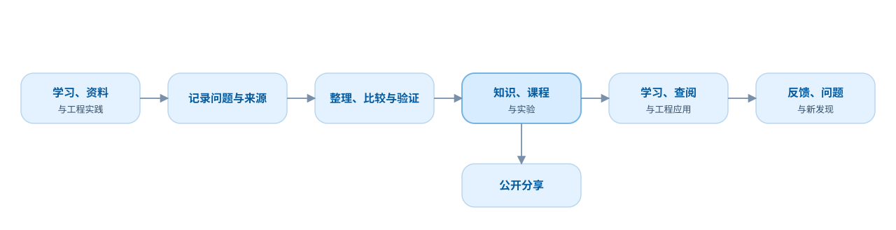

# 项目章程

## 项目名称

**Embedded Learning Lab**

中文名称：**嵌入式学习实验室**

## 使命

建立一个能够长期服务个人学习、查阅和工程实践的嵌入式资料策展与验证实验室，把可靠来源和真实实践逐步整理成：

- 可检索、可评价的资料库；
- 有出处的主题指南与对照；
- 可练习的渐进课程；
- 可操作的实验与可视化；
- 可追溯的问题记录；
- 可复用的工程经验与工具。

成熟且经过验证的策展成果可以公开，供其他学习者和工程师参考。项目不声称创造标准、芯片行为或其他外部技术事实。

## 首要用户

第一阶段的首要用户是项目作者本人。

公开读者是重要但次一级的用户。项目不应为了追逐平台流量，牺牲个人长期使用价值、技术准确性或可维护性。

第一版采用双层产品形态：Git 仓库承担创作、审核和版本管理，网站承担课程学习、知识查询和公开阅读。项目内容源全部公开，不建设私有内容模式。

## 要解决的问题

- 嵌入式资料分散在教材、官方手册、博客、视频、代码和实际项目中，质量、版本和许可边界不一；
- 学过的内容容易遗忘，缺少快速回顾入口；
- 文章、课程、实验和代码彼此割裂；
- 实际问题的排查过程没有被持续沉淀；
- 社交平台适合传播，却不适合作为长期知识主库；
- AI 可以提高整理效率，但容易制造缺少验证的技术内容。

## 产品假设

如果先把可靠资料整理成具有身份、版本、许可、适用范围和阅读定位的资料库，再用路线、指南、课程和实验连接这些资料，就能同时降低检索、学习、复习和工程验证成本。

内容不局限于个人已有项目。官方资料、书籍、论文、公开文章、公开视频和其他课程都可以进入资料库，但必须经过来源记录、许可判断、用途评价和必要的交叉核对。项目可以提供独立解释和实验结果，但不得把外部内容改写后冒充原创事实。

## 项目价值循环

项目通过一轮轮小循环持续演进。图中不绘制跨越整张图的回线，以免流程关系被视觉噪声掩盖。

## 长期内容类型

- Paths：按目标组织的学习路径；
- Knowledge：稳定、结构化的知识解释；
- Courses：可循序学习和练习的课程；
- Labs：解释机制的交互实验和可视化；
- Projects：围绕真实成果组织的工程项目；
- Notes：问题、资料、实验和复盘记录；
- Tools：解决具体工程任务的工具。

## 当前目标

规划门槛已经完成，当前目标是交付 UART 最小纵向切片：

1. 以 Astro 静态站点承载内容、导航、主题和搜索；
2. 建立 UART 与嵌入式 C 所需的首批资料卡，并把现有 Knowledge 收敛为有出处的主题指南；
3. 形成一门渐进课程、必要互动、实机实验和少量分层面试题；
4. 跑通内容校验、生产构建和 GitHub Pages 发布；
5. 用真实切片验证内容模型、课程协议和视觉规范，再决定下一步扩展。

## 当前非目标

- 构建完整的嵌入式百科；
- 同时覆盖所有芯片、平台和方向；
- 建立社区、论坛或社交网络；
- 建立多用户协作和复杂权限系统；
- 为了展示蓝图而创建空功能；
- 把 AI 聊天框当作核心产品；
- 在内容和流程尚未验证前设计商业化系统。

## 核心原则

1. 个人价值优先，公开价值自然产生。
2. 真实实践驱动，不为填目录而创作。
3. 原始来源保持身份，项目策展记录保持单一来源。
4. 技术事实必须能回到来源或可复现实验。
5. 小而完整优先于大而空泛。
6. 课程和交互必须帮助学习者使用资料并形成证据，而不是替代来源或充当装饰。
