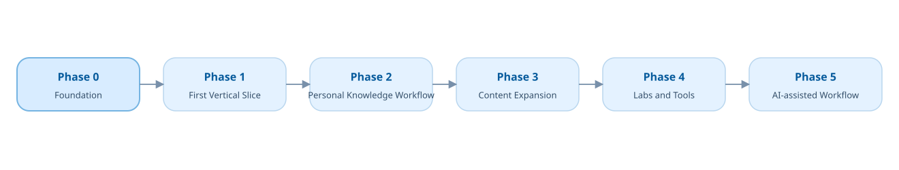

# 路线图

路线图表达讨论和验证顺序，不承诺提前实现全部长期模块。

阶段可以根据实际反馈回顾和调整，但回顾不是独立阶段，因此不在主路线图中绘制逆向连线。

## Phase 0 — Foundation

当前阶段。

目标：确定产品、内容和技术边界，满足规划门槛。

## Phase 1 — First Vertical Slice

目标：用一个真实主题验证资料卡、主题指南、课程、交互和网站之间的完整链路。

主题已经确定为 UART。具体页面、内容、互动、实验和验收见 `../product/first-release-scope.md`。

## Phase 2 — Personal Research Workflow

目标：验证资料发现、版本与许可记录、阅读定位、交叉核对、复习和发布是否真正降低个人负担。

## Phase 3 — Curated Coverage Expansion

目标：在已有模式经过验证后，增加少量高价值资料集合、主题指南和学习路径，不追求填满百科栏目。

## Phase 4 — Labs and Tools

目标：把已经证明具有价值的交互与计算能力提升为独立实验或工具。

## Phase 5 — AI-assisted Workflow

仅在来源身份、许可、引用关系和检索评估稳定后，讨论 AI 导航、解释和整理辅助。
